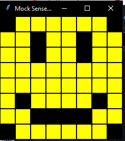
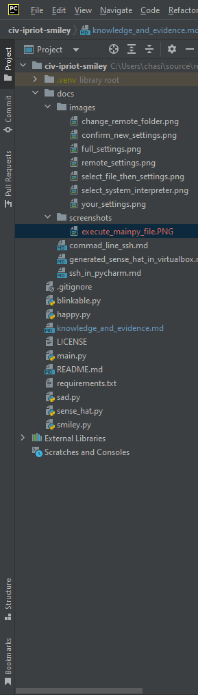
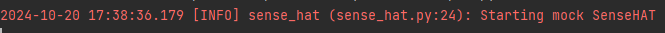
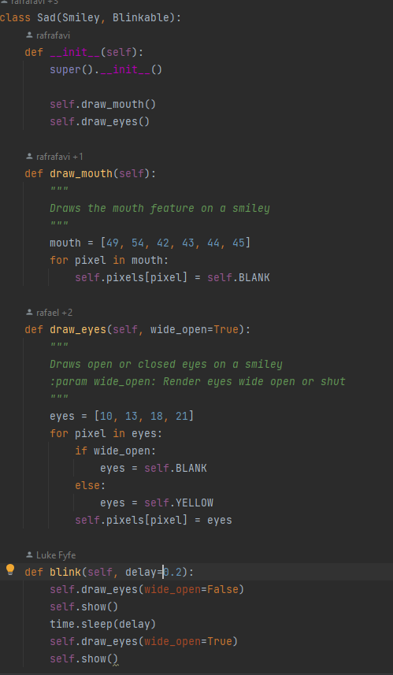
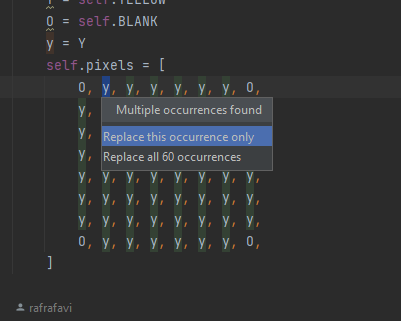

<style>

body {
    counter-reset: h2counter;
}

/* H1 - No numbering */
h1 {
    /* No counter reset or increment */
}

/* H2 - Level 1 numbering */
h2 {
    counter-reset: h3counter;
}

h2::before {
    counter-increment: h2counter;
    content: counter(h2counter) ". ";
}

/* H3 - Level 2 numbering */
h3 {
    counter-reset: h4counter;
}

h3::before {
    counter-increment: h3counter;
    content: counter(h2counter) "." counter(h3counter) " ";
}

/* H4 - Level 3 numbering (optional) */
h4 {
    counter-reset: h5counter;
}

h4::before {
    counter-increment: h4counter;
    content: counter(h2counter) "." counter(h3counter) "." counter(h4counter) " ";
}

</style>

# Evidence and Knowledge

This document includes instructions and knowledge questions that must be completed to receive a *Competent* grade on this portfolio task.

## Required evidence

### Answer all questions in this document

- Each answer should be complete, well-articulated, and within the specified word count limits (if added) for each question.
- Please make sure **all** external sources are properly cited.
- You must **use your own words**. Please include your full chat transcripts if you use generative AI in any way.
- Generative AI hallucinates, is not an authoritative source

### Make all the required modifications to the code

- Please follow the instructions in this document to make the changes needed to the code.

- When requested to upload evidence, upload all screenshots to `screenshots/` and embed them in this document. For example:

```markdown

```

- You must upload the code into your GitHub repository.
- While you can use a branch, your code should be in main when you submit.
- Upload a zip of this repository to Blackboard when you are ready to submit.
- You will be notified of your result via Blackboard
- However, if using GitHub classrooms, you may also receive additional feedback on GitHub directly

### Optional: Use of Raspberry Pi and SenseHat

Raspberry Pi or SenseHat is **optional** for this activity. You can use the included `sense_hat.py` file to simulate the SenseHat on your computer.

If you use a Pi, please **delete** the `sense_hat.py` file.

### Accessible version of the code

This project relies on visual patterns that appear on an LED matrix. If you have any accessibility requirements, you can use the `udl/accessible` branch to complete the project. This branch provides an accessible code version that uses text-based patterns instead of visual ones.

Please discuss this with your lecturer before using that branch.

## Specific Tasks & Questions

Address the following tasks and questions based on the code provided in this repository.

### Set up the project locally

1. Fork this repository (if not using GitHub Classrooms)
2. Clone your repository locally
3. Run the project locally by executing the `main.py` file
4. Evidence this by providing screenshots of the project directory structure and the output of the `main.py` file




If you are running on a Raspberry Pi, you can use the following command to run the project and then screenshot the result:

```bash
ls
python3 main.py
```

### Fundamental code comprehension

 Answer each of the following questions **as they relate to that code** supplied by in this repository (ignore `sense_hat.py`):

1. Examine the code for the `smiley.py` file and provide  an example of a variable of each of the following types and their corresponding values (`_` should be replaced with the appropriate values):

   | Type                    | name                                     | value                   |
   |------------------------------------------|-------------------------| --------------          |
   | built-in primitive type | self.sense_hat.low_light                 | true                    |
   | built-in composite type | WHITE                                    | (255, 255, 255)         |
   | user-defined type       | self.sense_hat                           | SenseHat()              |

2. Fill in (`_`) the following table based on the code in `smiley.py`:

   | Object                   | Type                     |
   |--------------------------| ----------------------- |
   | self.pixels              | list                     |
   | A member of self.pixels  | tuple                    |
   | self                     | Smiley                   |

3. Examine the code for `smiley.py`, `sad.py`, and `happy.py`. Give an example of each of the following control structures using an example from **each** of these files. Include the first line and the line range:

   | Control Flow | File      | First line                     | Line range   |
   |-----------|--------------------------------|--------------| -----------  |
   |  sequence    | smiley.py | from sense_hat import SenseHat | 40           |
   |  selection   | sad.py    | if wide_open:                  | 31           |
   |  iteration   | happy.py  | for pixel in eyes:             | 30           |

4. Though everything in Python is an object, it is sometimes said to have four "primitive" types. Examining the three files `smiley.py`, `sad.py`, and `happy.py`, identify which of the following types are used in any of these files, and give an example of each (use an example from the code, if applicable, otherwise provide an example of your own):

   | Type                    | Used?     | Example                 |
   |-----------|-------------------------| --------                |
   | int                     | sad.py    | for pixel               |
   | float                   | N/A       | number = 5.0            |
   | str                     | N/A       | word = "this is a string" |
   | bool                    | smiley.py | dimmed = true           |

5. Examining `smiley.py`, provide an example of a class variable and an instance variable (attribute). Explain **why** one is defined as a class variable and the other as an instance variable.

> A class variable would be the const tuples WHITE,RED, etc. This is a class variable as all instances will have a default value that doesn't change (hence the const) for rgb &
> why it is a class variable. You wouldn't want RBG values to change so you definitely wouldn't set it is an attribute so different instances of smiley have different rgb values. 
> 
> An attribute is instantiated, so every instance of smiley could have different versions of the attributes. The pixels list in smiley is an instance variable so that different versions of 
> smiley can be instantiated, different instances can have different colours in that list.
>

6. Examine `happy.py`, and identify the constructor (initializer) for the `Happy` class:
   1. What is the purpose of a constructor (in general) and this one (in particular)?

   > A constructor allows logic to be executed as soon as the object is created, this allows the constructor to set values or call functions to have some default functionality
   > created. 
   > 
   > Super is called at the start so the parent class can assign values and call functions that will be required for happy. 
   >
>   As it is a happy class methods to draw the smile and eyes are called as the object is created. 

   2. What statement(s) does it execute (consider the `super` call), and what is the result?

   > the super method is called so any logic called within the constructor in smiley(the parent) will be called and happy will use this data.
> 
>   the draw_mouth() and draw_eyes() methods are called which uses the values set when calling the super method, resulting in the happy face. 
   >

### Code style

1. What code style is used in the code? Is it likely to be the same as the code style used in the SenseHat? Give to reasons as to why/why not:
   
> The style used in this code is PEP8. This is a common code style so it is more than likely sensehat uses the same code style. Since this code
> imports sensehat it would make sense to use the same code style. When importing sense_hat the snake case is used indicating PEP8 could be used. 
>

2. List three aspects of this convention you see applied in the code.

> Snake casing
> Imports on seperate lines
> 4 spaces for indentation
>

3. Give two examples of organizational documentation in the code.

> Comments
> Docstrings
>

### Identifying and understanding classes

> Note: Ignore the `sense_hat.py` file when answering the questions below

1. List all the classes you identified in the project. Indicate which classes are base classes and which are subclasses. For subclasses, identify all direct base classes.
  
  Use the following table for your answers:

| Class Name | Super or Sub? | Direct parent(s)  |
|------------|---------------|-------------------|
| Smiley     | sub           | Object            |
| Blinkable  | sub           | ABC               |
| Happy      | sub           | Smiley, Blinkable |
| Sad        | sub           | Smiley            |

2. Explain the concept of abstraction, giving an example from the project (note "implementing an ABC" is **not** in itself an example of abstraction). (Max 150 words)

> Abstraction is a way of taking a bunch of details like attributes, functions, values and converting it into a more simple, readable and understandable details
> to hide any unnecssary complexity. Abstraction allows the programmer to start implementing their own logic without having to worry about the complexity behind the abstraction.
> 
> An example of abstraction in the project is the blink method. In main.py the blink method is called in main() by doing smiley.blink(). 
> When you want to make the face blink, you just simply want to make it blink. You don't care about all the complexities underneath and how it works. You just want it to blink at a certain
> time.
>

3. What is the name of the process of deriving from base classes? What is its purpose in this project? (Max 150 words)

> This is called inheritance and generalization. 
> The purpose for inheritance in this project is to have one super class that initializes al the default data to output a face.
> The child classes then inherit all of those attributes and methods and implements it's own functionality to either make the face happy or sad.
> This allows different types of objects to be created.
> This allows the code to be reusable, structured and ensures uniform default attributes/methods to prevent bugs.
>

### Compare and contrast classes

Compare and contrast the classes Happy and Sad.

1. What is the key difference between the two classes?
   > Happy inherits from the abstract class blinkable. 
   >
2. What are the key similarities?
   > They both implement draw_mouth() & draw_eyes() methods and call the methods in the constructor. 
   >
3. What difference stands out the most to you and why?
   > The extra method in happy stands out to me more as it's obvious there is more functionality in happy. 
   >
4. How does this difference affect the functionality of these classes
   > Objects instantiated from happy can blink while sad objects cannot blink.
   >

### Where is the Sense(Hat) in the code?

1. Which class(es) utilize the functionality of the SenseHat?
   > Smiley and it's children happy & sad.
   >
2. Which of these classes directly interact with the SenseHat functionalities?
   > Smiley as it instantiates a SenseHat. 
   >
3. Discuss the hiding of the SenseHAT in terms of encapsulation (100-200 Words)
   > SenseHat is instantiated within the smiley class, it is now an attribute that cannot be accessed without the smiley class.
   > When an object is created such as face = Smiley() a sense_hat is now instantiated within face.
   > To access sense_hat we could do face.sense_hat and this would allow access. 
   > Trying to access sense_hat on it own will throw an error as it won't know about the instantiated sense_hat. 
   > This isn't encapsulated 'privately' still though, if we wanted sense_hat to only be accessed within the class we would have to use te _ or __ to make it 'private' and define some getter and setter methods if required. 
   >

### Sad Smileys Can’t Blink (Or Can They?)

Unlike the `Happy` smiley, the current implementation of the `Sad` smiley does not possess the ability to blink. Let's first explore how blinking has been implemented in the Happy Smiley by examining the blink() method, which takes one argument that determines the duration of the blink.

**Understanding Blink Mechanism:**

1. Does the code's author believe that every `Smiley` should be able to blink? Explain.

> No because if the author wanted every smiley to blink, smiley would inherit blinkable and the blink method. 
>

2. For those smileys that blink, does the author expect them to blink in the same way? Explain.

> No because there is a delay argument that can change the delay between blinks. 
>

3. Referring to the implementation of blink in the Happy and Sad Smiley classes, give a brief explanation of what polymorphism is.

> Polymorphism is where classes, methods, and attributes can be used in many forms. The blink method is polymorphic as
> sad and happy both use the same method but with their own functionality, therefore being used in different 'forms'. 
>

4. How is inheritance used in the blink method, and why is it important for polymorphism?

> Each class that inherits from blinkable also inherits the blink method and must have their own implementation for blink.
> This is important as instances of a child class can be treated as an object of the super class, allowing for polymorphism. 
> For example you could implement functionality for all objects that are a smiley to call the blink function, without having to know the object type Happy for example.
>
1. **Implement Blink in Sad Class:**

   - Create a new method called `blink` within the Sad class. Ensure you use the same method signature as in the Happy class:

   ```python
   def blink(self, delay=0.25):
       pass  # Replace 'pass' with your implementation
   ```

2. **Code Implementation:** Implement the code that allows the Sad smiley to blink. Use the implementation from the Happy Smiley as a reference. Ensure your new method functions similarly by controlling the blink duration through the `delay` argument.

3. **Testing the Implementation:**

- Test the new blink functionality on your Raspberry Pi or within the Python classes provided. You might need to adjust the `main.py` script to incorporate Sad Smiley's new blinking capability.

Include a screenshot of the sad smiley or the modified `main.py`:



- Observe and document the Sad smiley as it blinks its eyes. Describe any adjustments or issues encountered during implementation.

  > No issues but only blinks once. 

  ### If It Walks Like a Duck…

  Previously, you implemented the blink functionality for the Sad smiley without utilizing the class `Blinkable`. Assuming you did not use `Blinkable` (even if you actually did), consider how the Sad smiley could blink similarly to the Happy smiley without this specific class.

  1. **Class Type Analysis:** What kind of class is `Blinkable`? Inspect its superclass for clues about its classification.

     > it is an ABCMeta class. 

  2. **Class Implementation:** `Blinkable` is a class intended to be implemented by other classes. What generic term describes this kind of class, which is designed for implementation by others? **Clue**: Notice the lack of any concrete implementation and the naming convention.

  > Abstract

  3. **OO Principle Identification:** Regarding your answer to question (2), which Object-Oriented (OO) principle does this represent? Choose from the following and justify your answer in 1-2 sentences: Abstraction, Polymorphism, Inheritance, Encapsulation.

  > Inheritance as each class that is a child of blinkable has to implement the blink method. It also represents polymorphism as you could write code
  > to treat each class as the same super class without needing to know the specific type the object is. 

  4. **Implementation Flexibility:** Explain why you could grant the Sad Smiley a blinking feature similar to the Happy Smiley's implementation, even without directly using `Blinkable`.

  > Blinkable doesn't have any concrete methods so you can just put that code in another class. By inheriting multiple classes from blinkable it makes the classes more structured and modular.

  5. **Concept and Language Specificity:** In relation to your response to question (4), what is this capability known as, and why is it feasible in Python and many other dynamically typed languages but not in most statically typed programming languages like C#? **Clue** This concept is hinted at in the title of this section.

  > In python you can implement multi inheritance but in c# for example you cannot as it does not allow multi inheritance. As you cannot use multi inheritance you would have to use another alternative such as interfaces to avoid
  > having to re write code for each class making the code prone to bugs later down the line. 

  ***

  ## Refactoring

  ### Does a Smiley Have to Be Yellow?

  While our current implementation predominantly features yellow smileys, emotional expressions like sickness or anger typically utilize colors like green, red, or orange. We'll explore the feasibility of integrating these colors into our smileys.

  1. **Defined Colors and Their Location:**

     1. Which colors are defined and in which class(s)?
        > White, Green, red, yellow, blank in Smiley.
     2. What type of variables hold these colors? Are the values expected to change during the program's execution? Explain your answer.
        > They are Tuples and should not be changed as they are const. 
     3. Add the color blue to the appropriate class using the appropriate format and values.

  2. **Usage of Color Variables:**

     1. In which classes are the color variables used?
        > Smiley, Happy, Sad

  3. **Simple Method to Change Colors:**
  4. What is the easiest way you can think to change the smileys to green? Easiest, not necessarily the best!
     > In line 22 of happy.py, within the for loop change self.BLANK to self.GREEN

  Here's a revised version of the "Flexible Colors – Step 1" section for the smiley project, incorporating your specifications for formatting and content updates:

  ### Flexible Colors – Step 1

  Changing the color of the smileys once is straightforward, but it isn't very flexible. To facilitate various colors for smileys, it is advisable not to hardcode values in any class. This approach was identified earlier as a necessary change. Let's start by removing the built-in assumptions about color in our classes.

  1. **Add a method called `complexion` to the `Smiley` class:** Implement this instance method to return `self.YELLOW`. Using the term "complexion" instead of "color" provides a more abstract terminology that focuses on the meaning rather than implementation.

  2. **Refactor subclasses to use the `complexion` method:** Modify any subclass that directly accesses the color variable to instead utilize the new `complexion` method. This ensures that color handling is centralized and can be easily modified in the future.

  3. **Determine the applicable Object-Oriented principle:** Consider whether Abstraction, Polymorphism, Inheritance, or Encapsulation best applies to the modifications made in this step.
        Inheritance
  4. **Verify the implementation:** Ensure that the modifications function as expected. The smileys should still display in yellow, confirming that the new method correctly replaces the direct color references.

  This step is crucial for setting up a more flexible system for color management in the smiley display logic, allowing for easy adjustments and extensions in the future.

  ### Flexible Colors – Step 2

  Having removed the hardcoded color values, we now enhance the base class to support dynamic color assignments more effectively.

  1. **Modify the `__init__()` method in the `Smiley` class:** Introduce a default argument named `complexion` and assign `YELLOW` as its default value. This allows the instantiation of smileys with customizable colors.

  2. **Introduce a new instance variable:** Create a variable called `my_complexion` and assign the `complexion` parameter to it. This step ensures that each smiley instance can maintain its own color state.

  3. **Rationale for `my_complexion`:** Using a distinct instance variable like `my_complexion` avoids potential conflicts with the method parameter names and clarifies that it is an attribute specific to the object.

  4. **Bulk rename:** We want to update our grid to use the value of complexion, but we have so many `Y`'s in the grid. Use your IDE's refactoring tool to rename all instances of the **symbol** `Y` to `X`. Where `X` is the value of the `complexion` variable. Include a screenshot evidencing you have found the correct refactor tool and the changes made.

  
- 

  5. **Update the `complexion` method:** Adjust this method to return `self.my_complexion`, ensuring that whatever color is assigned during instantiation is what the smiley displays.

  6. **Verification:** Run the updated code to confirm that Smileys still defaults to yellow unless specified otherwise.

  ### Flexible Colors – Step 3

  With the foundational changes in place, it's now possible to implement varied smiley colors for different emotional expressions.

  1. **Adjust the `Sad` class initialization:** In the `Sad` class's initializer method, change the superclass call to include the `complexion` argument with the value `self.BLUE`, as shown:

     ```python
     super().__init__(complexion=self.BLUE)
     ```

  2. **Test color functionality for the Sad smiley:** Execute the program to verify that the Sad smiley now appears blue.

  3. **Ensure the Happy smiley remains yellow:** Confirm that changes to the Sad smiley do not affect the default color of the Happy smiley, which should still display in yellow.

  4. **Design and Implement An Angry Smiley:** Create an Angry smiley class that inherits from the `Smiley` class. Set the color of the Angry smiley to red by passing `self.RED` as the `complexion` argument in the superclass call.

  ***
